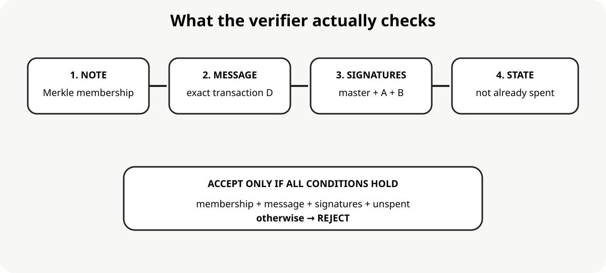
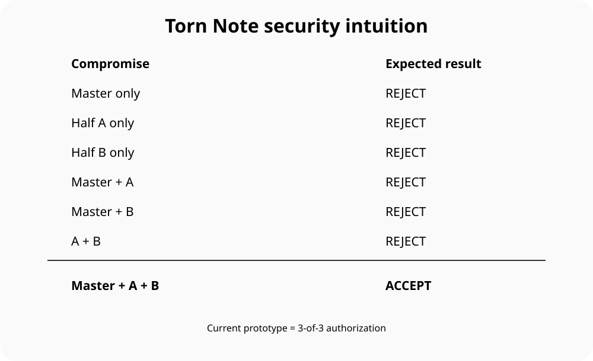

# 🧩 Torn Note Cryptography

### A cryptographic research experiment inspired by a torn piece of paper

Imagine a valuable paper note torn into two halves.

A person holding only the wallet's permanent key should **not** be able to spend it.

A person holding only half A should **not** be able to spend it.

A person holding only half B should **not** be able to spend it.

Only when the authorized pieces come together should the transaction be accepted.

> **Status: research prototype / v0.1. Not production cryptography.**

---

## 🧠 The idea in one picture

There are three independent authorization factors:

| Factor | Meaning |
|---|---|
| 🔑 Master | Long-lived wallet identity |
| 🧩 Half A | One unique fragment of a pre-issued note |
| 🧩 Half B | The other unique fragment |

The verifier accepts only when **all three signatures** are valid, the note belongs to the committed inventory, and the note has not been spent.

---

# 1. Why does this exist?

A conventional signature answers:

> Does the owner of this private key approve this transaction?

Torn Note asks:

> Does the owner approve it **and** does this particular pre-issued authorization object belong to this transaction?

The distinction is useful to research:

- offline authorization
- high-value transactions
- delegated authorization
- device + wallet authorization
- recovery mechanisms
- offline digital-cash-like systems
- decentralized identity
- EUDI experiments

This repository does **not** claim that the idea is novel or production-ready. It is an openly documented research experiment.

---

# 2. The physical torn-note model

The paper analogy maps to cryptography:

| Physical note | Cryptographic model |
|---|---|
| Wallet identity | Master public key X |
| Half A | Public key A + private key a |
| Half B | Public key B + private key b |
| Serial number | noteId |
| Registered notes | Merkle commitment |
| Written transaction | Transaction digest |
| Matching pieces | Valid signatures |
| Used note | Spent state |

The important property is not merely "three signatures".

The note halves are **pre-issued, individually identifiable, and committed before the transaction happens**.

---

# 3. Mathematical model

Let G be the generator of a prime-order elliptic-curve group q.

Long-lived wallet secret:

x ∈ Zq

Public key:

X = xG

For note i:

zA,i , zB,i ∈ Zq

ZA,i = zA,i G

ZB,i = zB,i G

The conceptual composite transaction secret is:

s_i = x + zA,i + zB,i mod q

Therefore:

s_i G
= (x + zA,i + zB,i)G
= xG + zA,iG + zB,iG
= X + ZA,i + ZB,i

So:

P_i = X + ZA,i + ZB,i

This is the mathematical heart of the experiment.

### Important implementation boundary

The v0.1 code does **not** reconstruct s_i.

It uses three independent signatures instead:

Master signature + Half-A signature + Half-B signature

The equation is therefore the mathematical model for the desired threshold construction, not a claim that the current implementation safely combines all three secrets.

---

# 4. What is actually implemented?

For each issued note:

L_i =
H(
  "TORN-NOTE/leaf/v1"
  || noteId_i
  || pubA_i
  || pubB_i
)

All leaves are committed into:

ROOT = MerkleRoot(L_0, ..., L_n)

For transaction m:

D =
H(
  "TORN-NOTE/tx/v1"
  || ROOT
  || noteId
  || pubA
  || pubB
  || CanonicalEncode(m)
)

Then:

σM = Sign(skM, D)

σA = Sign(skA, D)

σB = Sign(skB, D)

The verifier accepts only if:

Member(L_i, ROOT)
AND
NOT Spent(i)
AND
Valid Master Signature
AND
Valid Half-A Signature
AND
Valid Half-B Signature

---

# 5. Why the Merkle tree matters

A dangerous design would say:

> Master key + any two new halves = valid transaction.

An attacker who steals the master key could then invent:

zA'
zB'

and construct a new public key:

P' = X + zA'G + zB'G

The mathematical key may be valid.

But the note was never issued.

The verifier therefore requires the note tuple to be committed in ROOT.

So:

Master key + invented note → ❌ REJECT

Master key + genuine A + genuine B → potentially valid, subject to all signatures and state.

This gives the system an important distinction:

**Valid cryptographic material ≠ authorized issued material.**

---

# 6. Security intuition

| Attacker has | Expected result |
|---|---|
| Master only | ❌ Reject |
| Half A only | ❌ Reject |
| Half B only | ❌ Reject |
| Master + A | ❌ Reject |
| Master + B | ❌ Reject |
| A + B | ❌ Reject |
| Master + A + B | ✅ Accept |

The current implementation is therefore a **3-of-3 authorization policy**.

---

# 7. Security model

The intended property is:

Pr[ForgeAcceptedTransaction] ≤ negligible(λ)

for an attacker missing at least one required authorization factor, assuming the underlying signature schemes are existentially unforgeable and SHA-256 remains collision resistant.

The adversary may know:

- all public keys
- the Merkle root
- previously observed transactions
- any strict subset of private authorization factors

The attack cases and reasoning are documented in [docs/SECURITY.md](docs/SECURITY.md).

This is a security argument, **not a formal proof**.

---

# 8. Attack surface tested

The prototype tests:

| Attack | Expected result |
|---|---|
| Forge master signature | ❌ |
| Forge Half-A signature | ❌ |
| Forge Half-B signature | ❌ |
| Change transaction amount | ❌ |
| Replace a note half | ❌ |
| Use the wrong note | ❌ |
| Replay spent note | ❌ |
| Invent arbitrary note | ❌ |

The goal is executable evidence supporting the security argument.

---

# 9. Benchmarks

The current benchmark measures the three-signature prototype.

One development runtime produced:

| Backend | Sign ms/tx | Sign tx/s | Verify ms/tx | Verify tx/s | Signature bytes |
|---|---:|---:|---:|---:|---:|
| Ed25519 | 0.1457 | 6,863.8 | 0.4544 | 2,200.6 | 192 |
| P-256 ECDSA | 0.1158 | 8,635.5 | 0.3489 | 2,866.5 | ~214 |

Workload:

- 32 pre-issued notes
- 500 authorization iterations
- three signatures
- separate verification benchmark

These are **machine-dependent measurements**, not universal performance claims.

Run locally:

    cd node
    npm test
    npm run benchmark

Full details: [docs/BENCHMARKS.md](docs/BENCHMARKS.md).

---

# 10. Why FROST?

Three signatures demonstrate the authorization semantics, but they are not the final cryptographic form.

The intended production direction is:

    Master share ──────┐
    Half-A share ──────┼──> FROST threshold Schnorr
    Half-B share ──────┘
                              |
                              v
                         ONE signature

FROST is specifically designed for threshold Schnorr signatures and is standardized in RFC 9591. Mature implementations exist for multiple curves. citeturn0search0turn0search4

The critical invariant is:

> No participant should need to reconstruct the complete long-lived secret or the complete composite transaction secret.

The future implementation should use an established FROST implementation rather than inventing a new threshold signature protocol.

---

# 11. EUDI direction

The authorization layer is transport-neutral.

A future adapter can conceptually connect:

EUDI presentation
        ↓
canonical transaction / claims
        ↓
transaction digest D
        ↓
Torn Note authorization
        ↓
verification result

Possible bindings include:

- SD-JWT VC
- mdoc / ISO 18013-5
- COSE
- OpenID4VP
- wallet/device authorization

This repository currently makes **no EUDI certification or compliance claim**.

---

# 12. Research questions

### Demonstrated

- per-note public authorization material
- immutable note inventory commitment
- 3-of-3 transaction authorization
- exact transaction binding
- replay-state hook
- executable attack tests
- standard cryptographic primitives
- benchmark harness
- mathematical formulation

### Still research

- FROST integration
- distributed key generation
- secure note issuance
- secure note transfer
- rollback-resistant spent state
- malicious signer handling
- nonce management
- privacy
- unlinkability
- recovery
- device compromise
- formal security proof
- EUDI protocol binding

---

# 13. Repository map

    torn-note-cryptography/
    ├── README.md
    ├── docs/
    │   ├── PROTOCOL.md
    │   ├── SECURITY.md
    │   ├── RESEARCH.md
    │   ├── ARCHITECTURE.md
    │   ├── BENCHMARKS.md
    │   └── images/
    │       ├── torn-note-overview.svg
    │       ├── torn-note-physical-model.svg
    │       ├── math-model.svg
    │       ├── verification-flow.svg
    │       └── security-matrix.svg
    ├── node/
    └── java/

The repository is intentionally organized like a small research project rather than only a source-code dump.

---

# 14. Disclaimer

This repository is a **cryptographic research prototype**.

It is not:

- a production wallet
- certified cryptography
- a FIPS module
- an EUDI Wallet implementation
- a formal cryptographic proof
- a recommendation to deploy with real money

The goal is to make the idea understandable, executable, reproducible and attackable.

---

## ⭐ The core idea

Permanent identity
+
Pre-issued fragment A
+
Pre-issued fragment B
+
Exact transaction
+
Authorized note membership

is intentionally stronger than ordinary single-key authorization.

The physical torn note is the intuition.

The Merkle tree makes the pieces **pre-authorized**.

The transaction digest makes them **message-specific**.

The signatures make the authorization **verifiable**.

And threshold Schnorr/FROST is the path toward making the same idea compact without reconstructing the complete secret.
