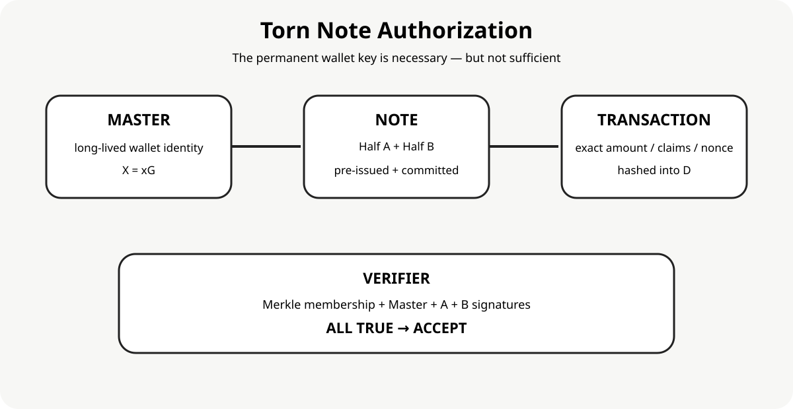

# Architecture

## Layers

    Transaction / EUDI adapter
                 |
                 v
    Canonical transaction digest
                 |
                 v
    Torn-note authorization
       master + A + B
                 |
                 v
    Merkle note inventory
                 |
                 v
    Standard primitives
       Ed25519 / P-256 / SHA-256

The authorization semantics are independent of the credential transport.

The future threshold backend can replace the three-signature layer with FROST without changing the high-level note commitment and transaction-binding concepts.
