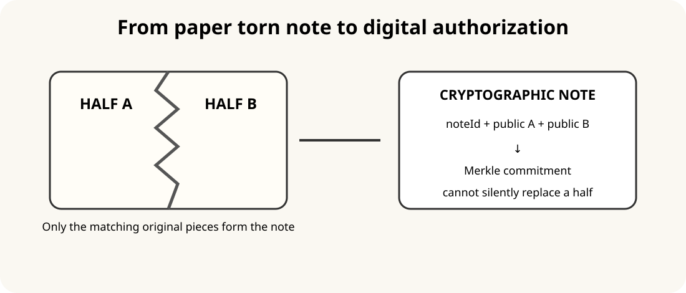
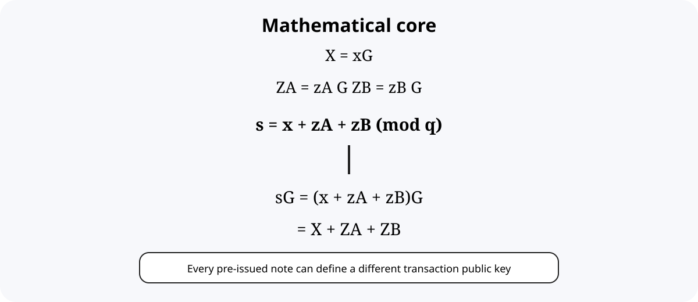

# Torn Note Cryptography — Research Note

## Abstract

Torn Note Cryptography explores whether the intuition of a physical torn note can be represented as a verifiable digital authorization mechanism.

The central idea is to separate a long-lived identity key from a pre-issued, consumable authorization object represented by two independent cryptographic fragments.

A transaction is accepted only when:

Identity AND Fragment A AND Fragment B AND Authorized Note AND Exact Transaction

are all satisfied.

The current implementation uses standard signature primitives and a Merkle commitment rather than claiming a new signature primitive.

## 1. Problem

A conventional signature gives:

Sign(sk, m)

Anyone who possesses sk can authorize future messages.

The research question is:

Can the long-lived identity key be necessary but insufficient, so that each transaction additionally requires a unique pre-issued authorization fragment?

## 2. Physical intuition

Note → Half A + Half B

Digitally, merely concatenating two secrets is not enough. An attacker must also be prevented from inventing replacement halves.

Therefore the design commits:

(noteId, pubA, pubB) → Merkle root

## 3. Algebra

X = xG

ZA = zA G
ZB = zB G

P_i = X + ZA + ZB

with conceptual secret:

s_i = x + zA + zB mod q

so:

s_i G = P_i

## 4. The important attack

Without pre-authorization, an attacker holding x can choose zA' and zB' and calculate a fresh P'.

Therefore the algebra alone is insufficient.

The fix is:

AuthorizedNote = MerkleMembership(noteId, ZA, ZB, ROOT)

A mathematically valid key is not automatically an authorized issued note.

## 5. Current implementation

The v0.1 implementation does not reconstruct s.

Instead:

Master signature + Half-A signature + Half-B signature

implement the authorization semantics directly.

## 6. Production hypothesis

The desired final system is:

three authorization shares
→ threshold Schnorr / FROST
→ one Schnorr signature

with no process reconstructing the complete secret.

## 7. Success criteria

- correctness
- unforgeability
- note binding
- transaction binding
- single use
- key separation
- auditable implementation

## 8. Failure criteria

The design is broken if an attacker can manufacture an authorized note from the master key alone, replace a half without invalidating membership, replay a spent note, modify signed contents, recover the secret below threshold, exploit nonce reuse, or produce an accepted signature below threshold.

The purpose of this repository is to make the idea easy for engineers and cryptographers to understand, reproduce and attack.
